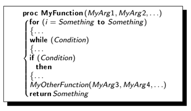

# Intuizione algoritmica

## Definizione di algoritmo
Algoritmo fino all'epoca moderna -> metodo per risoluzione simbolica di numeri
Algoritmo oggi -> qualsiasi procedura che da un input produce un output

problema -> ciò che dobbiamo risolvere
problema risolvibile -> esiste un algoritmo che lo risolve
istanza -> input di un problema
soluzione -> output di un problema

## Epoca moderna dell'informatica (con Turing)
computabilità -> caratteristica del problema e non dell'algoritmo che lo risolve
complessità -> caratteristica di entrambi, il problema e l'algoritmo che lo risolve

## Scrivere algoritmi
3 aspetti di un linguaggio:
- **sintassi** -> come strutturo una frase
- **semantica** -> cosa significa una frase
- **pragmatica** -> miglior modo di esprimere un concetto, fissata la sintassi e la semantica

ogni linguaggio è sufficientemente espressivo per esprimere qualsiasi algoritmo pertanto si usa lo pseudo codice

**dimensione dell'input** -> numero di bit che l'input occupa
**tempo di computazione** -> numero di passi elementari che si impiegano e tiene conto di costanti che nascondono dettagli implementativi
**indici array** -> iniziano da 1 (da 0 solo se specificato)
**complessità** -> tempo e spazio (di memoria)
