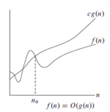
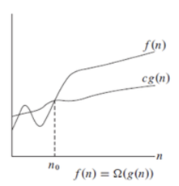
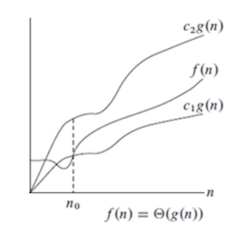

# Terminazione, Correttezza, Complessità
1. come si analizza un algoritmo e come di studia la sua complessità
2. distinzione tra iterazione e ricorsione
3. notazione asintotica

## 1. Analizzare gli algoritmi
4 caratteristiche principali di un algoritmo:
- **correttezza**: l'algoritmo restituisce sempre la risposta corretta
- **completezza**: ogni risposta corretta è restituita dall'algoritmo
- **terminazione**: l'algoritmo termina sempre (non entra in loop infiniti)
- **complessità**: l'algoritmo termina in un tempo ragionevole

## 2.a Caso iterativo
### Analisi algoritmica
esempio: InsertionSort
```pseudocode
proc InsertionSort (A) {
    for (j = 2 to A.length) {
        key = A[j]
        i = j − 1
        while ((i > 0) and (A[i] > key)) {
            A[i + 1] = A[i]
            i = i − 1
        }
        A[i + 1] = key
    }
}
```
- **terminazione** -> ciclo for termina quando j < A.length e ciclo while termina quando i <= 0 e A[i] <= key -> terminazione garantita da ciclo esterno e interno
- **correttezza** -> stabilire una proprietà di un ciclo che sia vera prima, durante e dopo l'esecuzione del ciclo -> tecnica/proprietà dell'invariante con A[1, ..., j-1] sempre ordinato
- **complessità**: definizione matematica del numero di passi necessari per eseguire l'algoritmo in termini della dimensione dell'input (annotare ogni istruzione, es. for, if, while, ecc., con il numero di passi che effettivamente compie)
```pseudocode
proc InsertionSort (A) {
    for (j = 2 to A.length) { --> n * c1
        key = A[j] --> (n - 1) * c2
        i = j − 1 --> (n - 1) * c3
        while ((i > 0) and (A[i] > key)) { --> c4 * Σ_{j=2}^{n} (t_j)
            A[i + 1] = A[i] --> c5 * Σ_{j=2}^{n} (t_j) - 1
            i = i − 1 --> c6 * Σ_{j=2}^{n} (t_j) - 1
        }
        A[i + 1] = key --> (n - 1) * c7
    }
}
```
- c1, c2, c3, c4, c5, c6, c7 sono costanti che dipendo da tante cose come il tipo di linguaggio, la macchina, ecc.
- n è la dimensione dell'input
- $t_j$ è il passo di esecuzione del ciclo while al passo j (va da 2 ad n):
    - caso migliore -> $t_j$ = 1 (ovvero input già ordinato)
    - caso peggiore -> $t_j$ = j (ovvero input ordinato al contrario)

- **caso migliore**:
$$T(n) = C + c4 * (n - 1)$$
con $C = c1 * n + c2 * (n - 1) + c3 * (n - 1) c7 * (n - 1)$ 
risulta una funzione di tempo lineare (con a,b costanti che non dipendono da n):
$T(n) = a * n + b$
con $a = c1 + c2 + c3 + c7+ c4$ e $b = -c2 - c3 - c7 - c4$

- **caso peggiore**: $$T(n) = C + c4 * ( \frac{n * (n + 1)}{2} - 1) + c5 * ( \frac{n * (n - 1)}{2} ) + c6 * ( \frac{n * (n - 1)}{2} )$$
risulta una funzione quadratica (con a,b,c costanti):
$T(n) = a * n^2 + b * n + c$

## 2.b Caso ricorsivo
### Analisi algoritmica
esempio: RecursiveBinarySearch
```pseudocode
proc RecursiveBinarySearch (A, low, high, k) {
    if (low > high)
        then return nil
    mid = (high + low)/2
    if (A[mid] = k)
        then return mid
    if (A[mid] < k)
        then return RecursiveBinarySearch(A, mid + 1, high, k)
    if (A[mid] > k)
        then return RecursiveBinarySearch(A, low, mid − 1, k)
}
```
- **terminazione** -> termina quando low > high
- **correttezza** -> concentrarsi su quello che accade dopo ogni chiamata ricorsiva -> tecnica/proprietà dell'invariante induttiva (es. A[low, ..., high] contiene sempre k)
    - **caso base**: alla prima chiamata low = 1 e high = n quindi se k è in A allora è sicuramente in A[low, ..., high]
    - **caso induttivo**: poichè A è ordinato si può affermare che:
        - se A[mid] = k -> restituisco mid
        - se A[mid] < k -> cerco in A[mid+1, ..., high]
        - se a[mid] > k -> cerco in A[low, ..., mid-1]
- **complessità**:
$T(n) = T(\frac{n}{2}) + c$

## 3. Notazione asintotica
### Studiare la complessità
$T(n) = \Theta(f(n))$ se si ottiene da $f(n)$ eliminando tutti i termini di ordine inferiore al maggiore e tutte le sue costanti
esempio: $T(n) = 3n^2 + 2n + 1$ diventa $\Theta(n^2)$

- Si confrontano quindi differenti algoritmi in base al loro comportmaneto asintotico nel caso peggiore
- La logica di un algoritmo è data dalle operazioni logiche e aritmetiche (for, while, ...), non dalle operazioni di assegnamento
- Quindi per calolare la complessità di un algoritmo si considerano solo le operazioni logiche e aritmetiche

### Notazione asintotica
#### 1) $O()$
$f(n)$ è limitata da (oppure è un "o" grande di) $g(n)$ (scritto: $f(n) = O(g(n))$) $\Leftrightarrow \exists$ una costante $c > 0$ t.c. per tutti gli $n \geq n_0$ : 

0 $\leq f(n) \leq c * g(n)$



#### 2) $\Omega()$
$f(n)$ è limitata dal basso da (oppure è un omega grande di) $g(n)$ (scritto: $f(n) = \Omega(g(n))$) $\Leftrightarrow \exists$ una costante $c > 0$ t.c. per tutti gli $n \geq n_0$ : 

0 $\leq c * g(n) \leq f(n)$



#### 3) $\Theta()$
$f(n)$ è dello stesso ordine di $g(n)$ $\Leftrightarrow \exists$ due costanti $c_1, c_2 > 0$ t.c. per tutti gli $n \geq n_0$ :

0 $\leq c_1 * g(n) \leq f(n) \leq c_2 * g(n)$

quindi $f(n) = \Theta(g(n)) \quad \Leftrightarrow \quad f(n) = O(g(n)) \text{ e } f(n) = \Omega(g(n))$



#### 4) $\omicron()$ e $\omega()$
Per confrontare gli ordini di grandezza delle funzioni si usano $\omicron()$ e $\omega()$ (o piccolo e omega piccolo)

- con $\omicron()$: $\lim_{n\to\infty} \frac{f(n)}{g(n)} = 0$
- con $\omega()$: $\lim_{n\to\infty} \frac{f(n)}{g(n)} = \infty$


## Proprietà di interesse di $O(), \Omega(), \Theta(), \omega(), \theta() $
In ambito algoritmico, le notazioni O(), Θ(), e Ω() sono utilizzate per descrivere il comportamento asintotico degli algoritmi, ovvero come il tempo di esecuzione o lo spazio utilizzato da un algoritmo scala rispetto alla dimensione dell'input.

**Proprietà di interesse:**

1. **Riflessività**:
   - f(n) = O(f(n)): ogni funzione è un limite superiore di se stessa.
   - f(n) = Ω(f(n)): ogni funzione è un limite inferiore di se stessa.
   - f(n) = Θ(f(n)): ogni funzione è uguale a se stessa in termini di crescita asintotica.

2. **Transitività**:
   - Se f(n) = O(g(n)) e g(n) = O(h(n)), allora f(n) = O(h(n)).
   - Se f(n) = Ω(g(n)) e g(n) = Ω(h(n)), allora f(n) = Ω(h(n)).
   - Se f(n) = Θ(g(n)) e g(n) = Θ(h(n)), allora f(n) = Θ(h(n)).

3. **Simmetria**:
   - f(n) = Θ(g(n)) se e solo se g(n) = Θ(f(n)): se due funzioni hanno lo stesso ordine di crescita, la relazione Θ è simmetrica.

4. **Asimmetria**:
   - Se f(n) = O(g(n)), non è necessariamente vero che g(n) = O(f(n)). Ad esempio, n = O(n^2), ma n^2 ≠ O(n).
   - Analogamente, se f(n) = Ω(g(n)), non è necessariamente vero che g(n) = Ω(f(n)).

5. **Altre proprietà**:
   - Somma: se f(n) = O(g(n)) e f(n) = O(h(n)), allora f(n) = O(max(g(n), h(n))).
   - Prodotto: se f(n) = O(g(n)) e h(n) = O(i(n)), allora f(n)h(n) = O(g(n)i(n)).
   - Multiplo costante: se f(n) = O(g(n)), allora kf(n) = O(g(n)) per qualsiasi costante k > 0.

Queste proprietà sono fondamentali per analizzare e confrontare gli algoritmi in base alla loro complessità asintotica.  
Permettono di stabilire relazioni tra funzioni di crescita e di semplificare le espressioni di complessità.

Esempio:  
Sapendo che f(n) = O(g(n)) e g(n) = O(h(n)), possiamo concludere che f(n) = O(h(n)) grazie alla proprietà transitiva, senza dover analizzare direttamente la relazione tra f(n) e h(n).