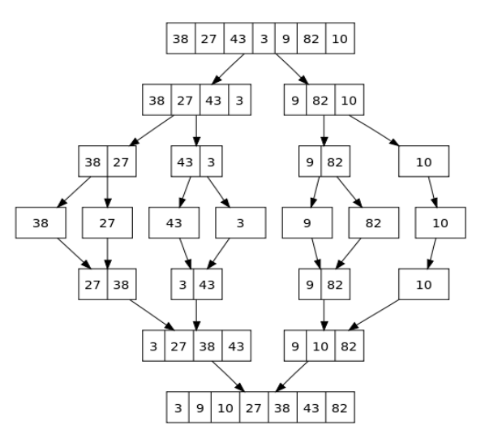
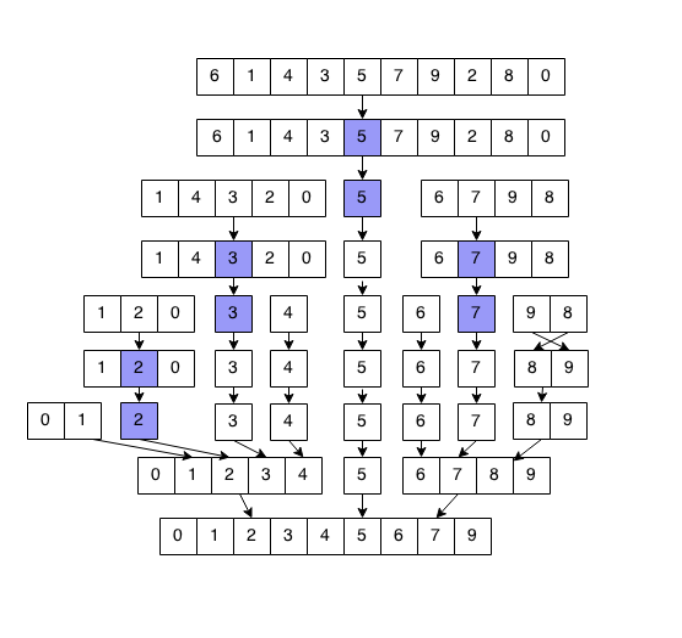

# MergeSort e QuickSort

Algoritmi di ordinamento elementari -> metodi basati sui confronti dove ogni elemento viene spostato verso il/al posto giusto separatamente dagli altri, in maniera iterativa o ricorsiva (es. InsertionSort, SelectionSort, BubbleSort, ...)

Algoritmi di ordinamento non elementari -> es. MergeSort, QuickSort, HeapSort (tipicamente quelli ricorsivi ma non è una regola)

## SelectionSort
```pseudocode
proc SelectionSort (A) {
    for (j = 1 to A.length - 1) {
        min = j
        for (i = j + 1 to A.length) {
            if (A[i] < A[min])
                then min = i
        }
        SwapValue(A, min, j)
    }
}
```

## MergeSort
### Merge
Algoritmo che risolve il problema di costruire una sequenza ordinata partendo da due sequenze ordinate

Input -> Array `A`, indici `p`, `q`, `r` con p ≤ q ≤ r e `A[p, ..., q]` e `A[q+1, ..., r]` sono ordinati  
Output -> A[p, ..., r] ordinato

```pseudocode
proc Merge (A, p, q, r) {
    n1 = q − p + 1
    n2 = r − q
    let L[1, . . . , n1] and R[1, . . . , n2] be new array
    for (i = 1 to n1) L[i] = A[p + i − 1]
    for (j = 1 to n2) R[j] = A[q + j]
    i = 1
    j = 1
    for (k = p to r ) {
        if (i ≤ n1) { --> L e R non sono ancora finiti
            then
            if (j ≤ n2) { 
                then
                if (L[i] ≤ R[j]) {
                    then CopyFromL(i)
                    else CopyFromR(j)
                }
                else CopyFromL(i) --> L non è ancora finito ma R si
            }
            else CopyFromR(j) --> R non è ancora finito ma L si
        }
    }
}
```

- **terminazione** -> i primi due cicli for terminano per $i = n_1$ e $j = n_2$ mentre il terzo for termina per $k = r$
- **correttezza** -> l'invariante è nel terzo ciclo ovvero dopo ogni iterazione del ciclo for, `A[p, ..., k − 1]` è ordinato
- **complessità** -> i primi due cicli for sono $\Theta(n_1)$ e $\Theta(n_2)$ quindi uguali a $\Theta(n)$ e il terzo for vale $\Theta(n)$ quindi la complessità vale $\Theta(n)$ e non devo distinguere tra i tre casi

### MergeSort
MergeSort è un algoritmo ricorsivo che usa l'algoritmo Merge come sotto-funzione per un nuovo algoritmo di ordinamento

```pseudocode
proc MergeSort (A, p, r) {
    if (p < r) {
        then
        q = [(p + r) / 2]
        MergeSort(A, p, q)
        MergeSort(A, q + 1, r)
        Merge(A, p, q, r)
    }
}
```



- **terminazione** -> ad ogni chiamata la distanza tra p e r deve diminuire, si effettua la nuova chiamata solo se $p \lt r$
- **correttezza** -> con invariante ricorsiva ovvero dopo ogni chiamata ricorsiva MergeSort(A, p, r), A[p, ..., r] è ordinato
    - caso base (p = r) -> non si effetuano chiamate poichè l'array `A[p, ..., r]` è già ordinato
    - caso induttivo (p < r) -> vengono fatte due chiamate a MergeSort, una su `A[p, ..., q]` e una su `A[q+1, ..., r]` e poi viene chiamato Merge(A, p, q, r) che unisce le due parti ordinate
- **complessità** -> $T(n) = 2 * T(\frac{n}{2}) + \Theta(n)$ e per il Master Theorem (caso 2) diventa $T(n) = \Theta(n \cdot \log(n))$

## QuickSort
### Partition
L'algoritmo Partition seleziona un pivot (un elemento casuale) e posiziona tutti gli elementi minori del pivot a sinistra mentre quelli maggiori a destra.  
Questa permutazione avviene in tempo lineare e senza spazio aggiuntivo.

Input -> Array `A`, indici `p` e `r` che rappresentano la porzione di array da considerare  
Output -> Indice `i + 1` del pivot in posizione ordinata
```pseudocode
proc Partition (A, p, r) {
    x = A[r]
    i = p − 1
    for (j = p to r − 1) {
        if (A[j] ≤ x) {
            then
            i = i + 1
            SwapValue(A, i, j)
        }
    }
    SwapValue(A, i + 1, r)
    return i + 1
}
```
Complessità -> $\Theta(n)$

### QuickSort
L'algoritmo QuickSort è un algoritmo ricorsivo che viene richiamato due volte dopo l'algoritmo Partition in modo che ogni volta il pivot sia in posizione corretta

```pseudocode
proc QuickSort (A, p, r) {
    if (p < r) {
        then
        q = Partition(A, p, r)
        QuickSort(A, p, q − 1)
        QuickSort(A, q + 1, r)
    }
}
```



- **terminazione** -> ad ogni chiamata la distanza tra p e r deve diminuire, si effettua la nuova chiamata solo se $p \lt r$
- **correttezza** -> invariante ricorsiva ovvero al termine di ogni chiamata ricorsiva QuickSort(A, p, r) con indici `p` e `r`, `A[p, ..., r]` è ordinato
    - caso base (p = r) -> l'array `A[p, ..., r]` ha una sola posizione quindi è già ordinato
    - caso induttivo (p < r) -> viene chiamato Partition(A, p, r) che restituisce l'indice del pivot e poi vengono fatte due chiamate a QuickSort, una su `A[p, ..., q-1]` e una su `A[q+1, ..., r]` che restituiscono l'array ordinato
- **complessità**: 
    - **caso migliore**: $\Theta(n \cdot \log_2(n))$ -> partizione bilanciata (quando si sceglie un pivot che ad ogni passo genera due sottoproblemi di dimensione n/2)
    - **caso peggiore**: $\Theta(n^2)$ -> partizione sbilanciata (quando si sceglie un pivot che ad ogni passo genera due sottoproblemi: uno di dimensione 0 e uno di dimensione n-1)
    - **caso medio**: $O(n \cdot \log_2(n))$

### RandomizedQuickSort
Con la versione randomizzata di QuickSort si sceglie un pivot casuale in modo che la partizione sia bilanciata

```pseudocode
proc RandomizedPartition (A, p, r) {
    s = p ≤ Random() ≤ r
    SwapValue(A, s, r)
    x = A[r]
    i = p − 1
    for (j = p to r − 1) {
        if (A[j] ≤ x) {
            then
            i = i + 1
            SwapValue(A, i, j)
        }
    }
    SwapValue(A, i + 1, r )
    return i + 1
}
```

- **complessità**: $\Theta(n)$

```pseudocode
proc RandomizedQuickSort (A, p, r) {
    if (p < r) {
        then
        q = RandomizedPartition(A, p, r)
        RandomizedQuickSort(A, p, q − 1)
        RandomizedQuickSort(A, q + 1, r)
    }
}
```

- **complessità**: $O(n \cdot \log_2(n))$

## Conlusione
MergeSort e QuickSort sono due algoritmi di ordinamento che si basano sul dividere il problema in più sottoproblemi e poi unirli in modo ordinato.