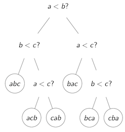
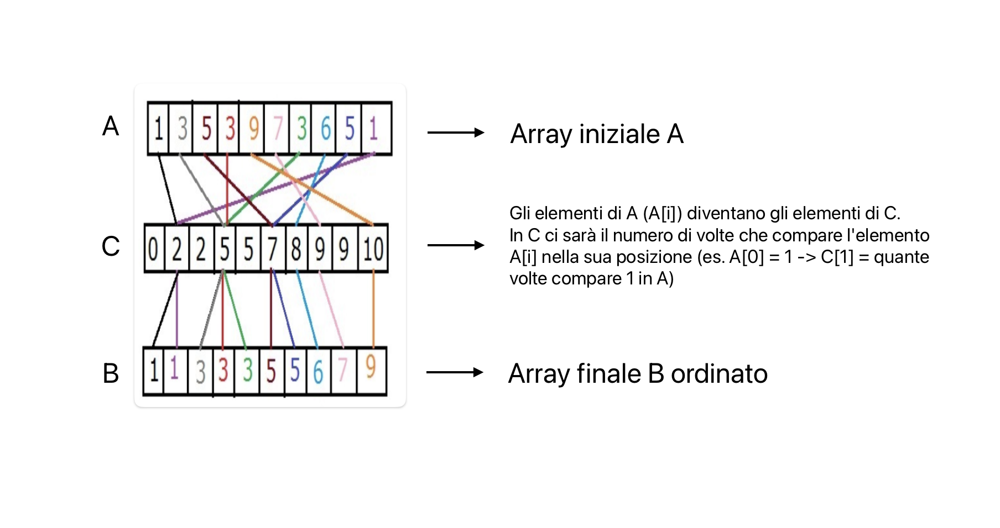
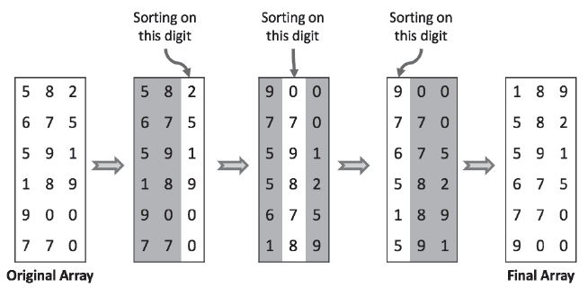

# CountingSort e RadixSort

## Limiti inferiori per l'ordinamento basato su confronti

**Obiettivo**: cercare la complessità minima del problema di ordinamento

### Minimo numero di operazioni di un tipo (es. confronto)
Un algoritmo di ordinamento si basa sui confronti se può essere visto come un'operazione di confronti (es. HeapSort)

Generalizzazione del processo di ordinamento: processo di ordinamento visto come albero binario (risposta si o no) con la radice come input e le foglie come output



Se devo ordinare $n$ oggetti e ogni decisione è binaria allora alle foglie di questo albero delle decisioni devono trovare posto $n!$ potenziali permutazioni.

L'altezza minima di un albero binario con $k$ foglie è $log_2(k)$

Quindi un albero di decisioni per ordinare $n$ oggetti ha come minimo altezza $log_2(n!)$

Il numero minimo di confronti è nell'ordine $\Theta(n \cdot log(n))$ quindi il limite inferiore per l'ordinamento basato su confronti è $\Omega(n \cdot log(n))$
- MergeSort è ottimo visto che nel caso peggiore ha complessità $\Theta(n \cdot log(n))$
- QuickSort non è ottimo neanche nella versione randomizzata

## CountingSort e RadixSort
Aggiungendo informazioni si può arrivare ad algoritmi di ordinamento con complessità lineare.  
Informazione aggiuntiva: gli elementi da ordinare sono interi compresi tra 0 e k

### CountingSort
CountingSort è un algoritmo di ordinamento lineare per ordinare interi compresi tra 0 e k, ma non è in place quindi si appoggia su un array di supporto C e restituisce un array ordinato B

```pseudocodice
proc CountingSort (A, B, k) {
    let C[0, . . . , k] new array
    for (i = 0 to k) C[i] = 0 --> azzerare i contatori
    for (j = 1 to A.length) C[A[j]] = C[A[j]] + 1 --> 1.
    for (i = 1 to k) C[i] = C[i] + C[i − 1] --> 2.
    for (j = A.length downto 1)

    B[C[A[j]]] = A[j]
    C[A[j]] = C[A[j]] − 1
}
```
1. inizializza i contatori in maniera tale che `C[i]` = numero di volte che `i` compare in A
2. calcola in `C` il numero di volte che `i` compare in `A`



- **correttezza** -> i primi 3 cicli for sono semplici da verificare, l'ultimo ciclo for è corretto perché B[C[A[j]]] è l'indice in cui deve essere inserito A[j] e C[A[j]] è decrementato per evitare che due elementi uguali vengano inseriti nello stesso posto (invariante)
- **complessità** -> $\Theta(n + k)$ quindi valido ma solo se k è lineare in n (per k non molto grande)

## RadixSort

RadixSort è un meta-algoritmo (si basa su un algoritmo interno che sia stabile) per ordinare n elementi multi-indice


```pseudocodice
proc RadixSort (A, d)
    for (i = 1 to d) AnyStableSort(A) on digit i
```



- **correttezza** -> invarianti: dopo la i-esima esecuzione del ciclo piú
interno, gli elementi formati dalle ultime i colonne sono correttamente
ordinati
- **terminazione** -> si verifica facilmente che il ciclo termina
- **complessità** -> $\Theta(d * (n + k))$ però caso pessimo è $O(d * f(n))$