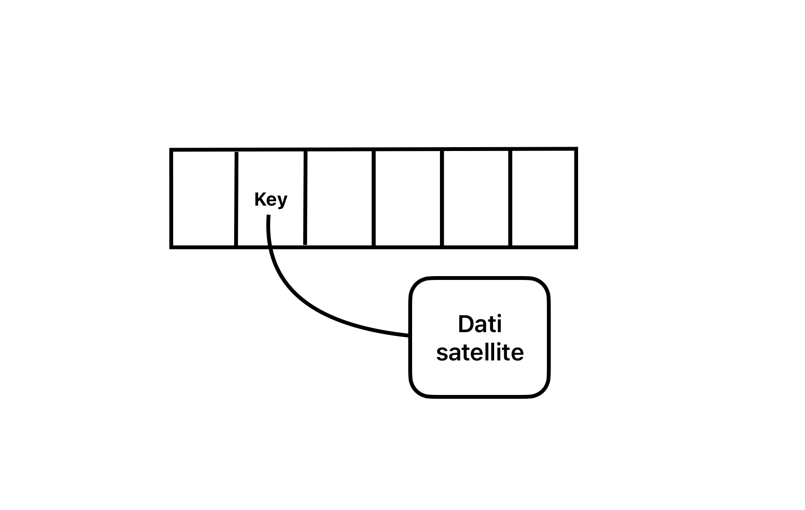

# Strutture dati
Le strutture dati si possono dividere:
- elementari (array, liste)
- non elementari (alberi, grafi)
- basate su ordinamento
- non basate su ordinamento

## Tassonomia delle strutture dati
**Tassonomia**: modo in cui le informazioni vengono raggruppate, classificate ed etichettate in un'ambiente condiviso.  
**Tassonomia delle strutture dati** prevede 3 dimensioni ortogonali tra loro:
- **statica o dinamica**:
    - **statica** (grafi, array): se la dimensione è fissata a priori
    - **dinamica** (liste): se la dimensione può variare durante l'esecuzione (a runtime)
- **compatta o sparsa**:
    - **sparse** (liste): gli elementi sono virtualmente vicini, ma fisicamente non sappiamo dove si trovano
  - **compatta** (array): gli elementi si trovano in posizioni fisiche di memoria contigue
- **basate o non basate su ordinamento di chiavi**:
    - **basate su ordinamento** (alberi binari di ricerca): se gli elementi sono ordinati secondo una chiave
    - **non basate su ordinamento** (liste, grafi): se non c'è alcuna relazione con una chiave

## Differenza tra chiave e dato satellite
- **chiave**: campo che identifica univocamente un elemento o dato satellite
- **dato satellite**: contenuto informativo della chiave

## Strutture dati concrete e astratte
- **struttura dati concreta**: struttura dati usata per la sua realizzazione, l'implementazione non è visibile
- **struttura dati astratta**: struttura dati definita solo in base alle sue proprietà ed alle operazioni applicabili ad essa