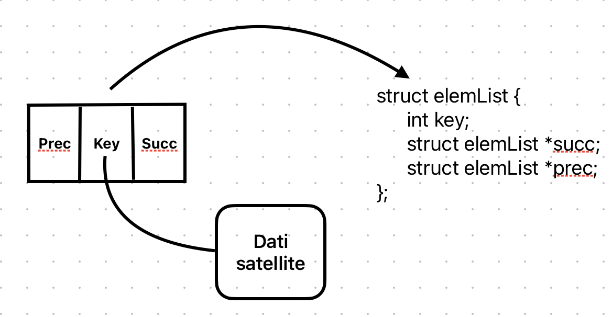

# Liste, pile, code

## Puntatori e liste
**Lista concatenata**:
- struttura dati dinamica, sparsa e non basata sull'ordinamento
- ogni elemento ha un campo dati e un campo puntatore al successivo
- si associano le operazioni di inserimento, cancellazione e ricerca (visto come array dinamico e sparso)

**Puntatori**: variabile che contiene un indirizzo in memoria, si associa al tipo di dato puntato (quindi un puntatore a un intero è diverso da un puntatore a un tipo di dato complesso)



### Gestione delle liste in memoria


### Codici per le liste

Si consideri il caso di liste non ordinate, doppiamente collegate (ogni elemento ha un puntatore al successivo e al precedente):

```pseudocode
typedef struct {
    int key;
    struct elemLista *succ;
    struct elemLista *prec;
} elemLista;


typedef struct {
    struct elemLista *head;
    int numel;
} List;


List *L;
L.head = nil;
L.numel = 0;
```
#### Algoritmi per le liste
```pseudocode
proc ListInsert (L, x) {
    x.next = L.head
    if (L.head != nil) {
        L.head.prev = x
    }
    L.head = x
    x.prev = nil
}
```
Complessità: $\Theta(1)$
```pseudocode
proc ListSearch (L, k) {
    x = L.head
    while (x != nil and x.key != k) {
        x = x.next
    }
    return x
}
```
Complessità: $\Theta(n)$
```pseudocode
proc ListDelete (L, x) {
    if (x.prev != nil) {
        x.prev.next = x.next
    } else {
        L.head = x.next
    }
    if (x.next != nil) {
        x.next.prev = x.prev
    }
}
```
Complessità: $\Theta(1)$


## Pile e Code
- **Tassonomia**: strutture dati dinamiche, non basate sull'ordinamento e pussono essere sparse (basate su liste) o compatte (basate su array)
- **Caratteristica**: accesso agli elementi vincolato ad una politica per far risparmiare dettagli implementativi, assicurando un certo ordine di inserimento ed estrazione

## Pile
**Pila (o stack)**: struttura dati astratta con politica FIFO  
Esempi d'uso: valutazione di espressioni, processi di backtracking, eliminazione di ricorsione, etc ...

### Pile su array
S -> array di interi (interpretata come stack) con parametri S.top (0 all'inizio) e S.max (capacità massima di S)

Operazioni:
- Empty(S): verifica se la pila è vuota
- Push(S, x): inserisce x in cima alla pila (inserimento)
- Pop(S): estrae l'elemento in cima alla pila (eliminazione)

```pseudocode
proc Empty (S) {
    if (S.top == 0)
        then return true
    return false
}
```

```pseudocode
proc Push (S, x) {
    if (S.top == S.max) 
        then error "overflow"
    S.top = S.top + 1
    S[S.top] = x
}
```

```pseudocode
proc Pop (S) {
    if (Empty(S)) 
        then error "underflow"
    S.top = S.top - 1
    return S[S.top + 1]
}
```

### Pile su liste
S -> lista senza campi aggiuntivi

Operazioni:
- Empty(S): verifica se la pila è vuota
- Push(S, x): inserisce x in cima alla pila (inserimento in testa, ListInsert)
- Pop(S): estrae l'elemento in cima alla pila (eliminazione, semplificazione di ListDelete)

```pseudocode
proc Empty (S) {
    if (S.head == nil)
        then return true
    return false
}
```

```pseudocode
proc Push (S, x) {
    ListInsert(S, x)
}
```

```pseudocode
proc Pop (S) {
    if (Empty(S)) 
        then error "underflow"
    x = S.head
    ListDelete(S, x)
    return x.key
}
```

## Code
**Coda (o queue)**: struttura dati astratta con politica FIFO  
Esempi d'uso: in una playlist le canzoni sono in coda (circolare), processi di visita di strutture dati come grafi, etc ...

### Code su array
Q -> array di interi (interpretata come coda) con parametri Q.head (1 all'inizio), Q.tail (1 all'inizio) e dim (0 all'inizio per riconoscere se la coda è vuota)

Operazioni:
- Enqueue(Q, x): inserisce x in coda alla coda (inserimento)
- Dequeue(Q): estrae l'elemento in testa alla coda (eliminazione)

```pseudocode
proc Enqueue (Q, x) {
    if (Q.dim == Q.length)
        then error "overflow"
    Q[Q.tail] = x
    if (Q.tail == Q.length)
        then Q.tail = 1
        else Q.tail = Q.tail + 1
    Q.dim = Q.dim + 1
}
```

```pseudocode
proc Dequeue (Q) {
    if (Q.dim == 0)
        then error "underflow"
    x = Q[Q.head]
    if (Q.head == Q.length)
        then Q.head = 1
        else Q.head = Q.head + 1
    Q.dim = Q.dim - 1
    return x
}
```

### Code su liste
Q -> lista con campo aggiuntivo Q.tail (Q.head è già presente nel formato lista)

Operazioni:
- Enqueue(Q, x): inserisce x in coda alla coda (inserimento in coda, ListInsert)
- Dequeue(Q): estrae l'elemento in testa alla coda (eliminazione, semplificazione di ListDelete)

```pseudocode
proc Empty (Q) {
    if (Q.head == nil)
        then return true
    return false
}
```

```pseudocode
proc Enqueue (Q, x) {
    ListInsert(Q, x)
}
```

```pseudocode
proc Dequeue (Q) {
    if (Empty(Q))
        then error "underflow"
    x = Q.tail
    Q.tail = x.prev
    ListDelete(Q, x)
    return x.key
}
```