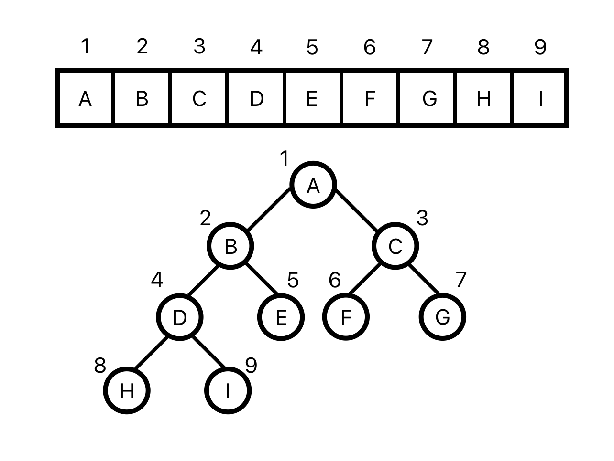
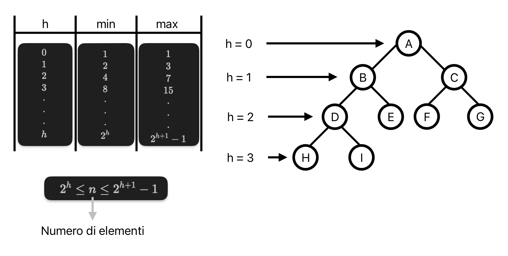

# Heap, HeapSort, Code di Priorità

## Heap
Le heap sono strutture dati astratte necessariamente compatte (basata su array), parzialmente basate sull'ordinamento, mantiene le chiavi semi-ordinate

Utilizzo: 
- come base per implementare **code di priorità** (struttura dati astratta)
- algoritmi di ordinamento **heapSort**, risolve i problemi di:
    - MergeSort -> non in place
    - QuickSort -> tempo quadratico nel caso peggiore

## Heap binarie su array
**(min/max) heap** -> Array H visto come un albero binario quasi completo

```pseudocode
typedef struct {
    int H[..];
    int length;
    int heapsize;
} Heap
```


**Caratteristiche**:
- i nodi dell'albero sono gli elementi dell'array
- `H[1]` -> la radice dell'albero
- `H.length` -> lunghezza massima raggiungibile
- `H.heapsize` -> dimensione corrente
- 0 ≤ `H.heapsize` ≤ `H.length`
- la Heap è un array, da non confondere con l'albero binario che viene usato solo come rappresentazione visuale e per terminologia (radice, nodi, altezza)

Convenzioni:
- **altezza**: altezza dell'albero (`H.length`)
- **radice**: primo elemento dell'array (`H[1]`)
- **nodo**: elemento dell'array (`H[i]`)

```pseudocode
proc Parent(i) {
    return i/2 // divisione intera
}
```

```pseudocode
proc Left(i) {
    return 2*i
}
```

```pseudocode
proc Right(i) {
    return 2*i + 1
}
```



- max-heap: il valore della chiave di un elemento è sempre maggiore di quella di entrambi i suoi figli (`H[Parent(i)]` ≥ `H[i]`)  
- min-heap: il valore della chiave di un elemento è sempre minore di quella di entrambi i suoi figli (`H[Parent(i)]` ≤ `H[i]`)
- altezza: lunghezza del cammino più lungo (numero di archi) dalla radice a una foglia

Esempio di min-heap e max-heap:


### Relazione tra il numero di elementi e l'altezza:



- $2^h \leq n \rightarrow h \leq log(n) \rightarrow$ altezza massima $= O(log(n))$
- $n \leq 2^{h+1} - 1 \rightarrow 2^{h+1} \geq n \rightarrow h+1 \geq log(n) \rightarrow$ altezza minima $= \Omega(log(n))$
- h = $\Theta(log(n))$

Un array qualsiasi non è sempre una heap, ma si può modificare la posizione degli elementi per ottenere una min/max-heap.  
**MinHeapify** risolve in parte il problema, valuta la posizione del padre e dei due figli per poi modificare eventualmente la posizione di un elemento per farlo diventare min-heap.


```pseudocode
proc MinHeapify (H, i) {
    l = Left(i) --> l = i*2
    r = Right(i) --> i*2 + 1
    smallest = i
    if ((l ≤ H.heapsize) and (H[l] < H[i]))
        then smallest = l
    if ((r ≤ H.heapsize) and (H[r] < H[smallest]))
        then smallest = r
    if smallest ≠ i {
        then
        SwapValue(H, i, smallest)
        MinHeapify(H, smallest)
    }
}
```

Tail ricorsione di MinHeapify: una funzione è in tail ricorsione se l'ultima operazione è la chiamata ricorsiva (si comporta come un'iterazione)

Proprietà di MinHeapify:
- **terminazione**: termina per due motivi: se `i` non cambia durante un'esecuzione o se è diventato più grande della dimensione della min-heap
- **correttezza**: se i figli sono una min-heap, dopo la chiamata ricorsiva il il padre con i figli è una min-heap
- **complessità**: considerazioni costo:
    - costo dipende dall'altezza h del nodo su cui viene chiamata -> O(h)
    - pertanto il costo massimo è O(numero di ) -> $\Theta(log(n))$
    - ma queste considerazioni nascondono la vera struttura
    - voglio comunuqe scrivere il costo in termini di ricorrenza
    - $T(n) = T(\frac{2}{3} n) + O(1)$ -> $\Theta(log(n))$ per Master Theorem caso 2

#### Costruzione min-heap:


```pseudocode
proc BuildMinHeap(H) {
    H.heapsize = H.length
    for (i = H.length/2 downto 1) 
        MinHeapify(H, i)
}
```

Proprietà di BuildMinHeap:
- `i = H.length/2`  -> primo indice dove ha senso chiamare MinHeapify
- **terminazione**: terminazione ovvia per il ciclo for
- **correttezza**: ad ogni iterazione, l'elemento `H[i+1], H[i+2], ...` è la radice di una min-heap
- **complessità**: minHeapify costa $\Theta(log(n))$ e viene chiamato $O(n)$ volte -> $\Theta(n)$ su al massimo $\frac{n}{2^{h+1}}$ elementi che si trovano ad altezza h

## HeapSort:
Algoritmo di ordinamento in place non stabile con complessità $\Theta(n \cdot log(n))$


```pseudocode
proc HeapSort(H) {
    BuildMaxHeap(H)
    for (i = H.length downto 2) {
        SwapValue(H, i, 1)
        H.heapsize = H.heapsize - 1
        MaxHeapify(H, 1)
    }
}
```

1. ``BuildMaxHeap``: costruisce una max-heap
2. ``for (i = H.length downto 2)``: dall'ultimo elemento al secondo
    1. ``SwapValue(H, i, 1)``: cambia primo e ultimo elemento
    2. ``H.heapsize --``: stacca l'ultimo elemento dalla heap 
    3. ``MaxHeapify(H, 1)``: eseguita sul primo elemento per far tornare l'array una MaxHeap su heapsize-1

Complessità: BuildMaxHeap $\Theta(n)$ + MaxHeapify $\Theta(n \cdot log(n))$ = $\Theta(n \cdot log(n))$

### Problema di stabilità
Tutti gli algoritmi di ordinamento instabili possono essere resi stabili scrivendo nella struttura dati un indice di posizione (es. array con indice e valore)


## Code di Priorità:
Struttura dati astratta basata su ordinamento e necessariamente compatta.
- Una coda di priorità si può costruire da una min-heap.
- A differenza della coda FIFO, la coda di priorità associa ad ogni elemento una chiave (priorità) ed estrae l'elemento con priorità più bassa con possibilità di inserimento, cambio priorità e aggiustamento struttura.

## Code di priorità su heap binarie
Q -> min-heap senza campi aggiuntivi

```pseudocode
proc ExtractMin(Q) {
    if (Q.heapsize < 1) {
        then return "underflow"
    }
    min = Q[1]
    Q[1] = Q[Q.heapsize]
    Q.heapsize = Q.heapsize - 1
    MinHeapify(Q, 1)
    return min
}
```


```pseudocode
proc DecreaseKey(Q, i, priority) {
    if (priority > Q[i]) {
        then return "error"
    }
    Q[i] = priority
    while ((i > 1) and (Q[Parent(i)] > Q[i])) {
        SwapValue(Q, i, Parent(i))
        i = Parent(i)
    }
}
```

```pseudocode
proc Enqueue(Q, priority) {
    if (Q.heapsize = Q.length) {
        then return "overflow"
    }
    Q.heapsize = Q.heapsize + 1
    Q[heapsize] = infinity
    DecreseKey(Q, Q.heapsize, priority)
}
```

## Code di priorità su array
Q -> array con:
- indice -> rappresenta l'elemento
- valore -> rappresenta la priorità
- valore aggiuntivo flag_empty -> rappresenta se l'elemento è presente o meno

```pseudocode
proc ExtractMin (Q) {
    MinIndex = 0
    MinPriority = infinity
    for (i = 1 to Q.length) {   
        if ((Q[i] < MinPriority) and (Q[i].empty = 0))
            then
            MinPriority = Q[i]
            MinIndex = i}
    if (MinIndex = 0)
        then return "underflow"
    Q[MinIndex].empty = 1
    return MinIndex
}
```

```pseudocode
proc DecreaseKey(Q, i, priority) {
    if ((Q[i] < priority) or (Q[i].empty = 1)) {
        then return "error"
    }
    Q[i] = priority
}
```

```pseudocode
proc Enqueue(Q, i, priority) {
    if (i > Q.length)
        then return "overflow"
    Q[i] = priority
}
```

## Differenze di complessità tra implementazione su heap e array
Entrambe le implementazioni sono valide, si sceglie quale delle due usare in base al problema da risolvere.

