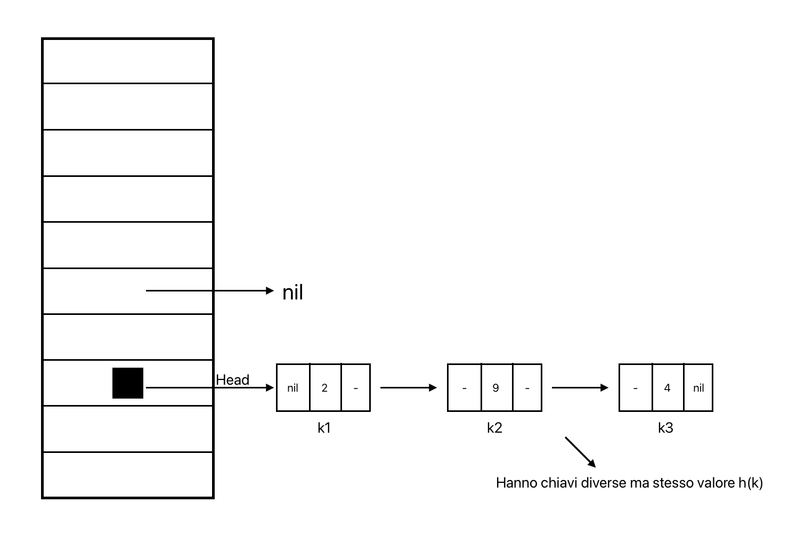

# Tabelle Hash
Le tabelle hash sono strutture dati astratte, dinamiche, parzialmente compatte e non basate sull'ordinamento

Uso: dato un numero di oggetti **relativamente piccolo**, ognuno dei quali è denotato da una chiave con universo **relativamente grande**, si vuole memorizzare in maniera dinamica gli oggetti e implementare operazioni di inserimento, cancellazione, ricerca

La tabella hash ad accesso diretto (uso di array) ha ottime complessità ($\Theta(1)$ per tutte le operazioni) ma solo se l'universo è piccolo -> si cercano soluzioni migliori

Essendo il numero di chiavi effettivamente utilizzate molto minore rispetto a quelle possibili, si può creare una **funzione di hash** che mappi le chiavi in un intervallo di indirizzamento più piccolo

T = array di m posizioni  
Problema: memorizzare una chiave k molto più grande di m  
Soluzione: funzione di hash che indirizza l'elemento k alla posizione h(k)  
Problema 2: conflitti -> quando `k1` ≠ `k2` ma `h(k1)` = `h(k2)`  
Soluzioni:  
1. chaining -> in ogni cella della tabella c'è un puntatore alla testa di una lista
2. open hashing -> provare più posizioni finchè non se ne trova una libera o se la tabella è piena

## Tabelle Hash con Chaining
Tecnica che risolve i conflitti di una tabella hash usando un puntatore alla testa di una lista in ogni cella (testa memorizzata in `T[h(k)]`, quando è vuota punta a `nil`)



### Operazioni
```pseudocode
proc HashInsert (T, k) {
    let x be a new node with key k
    i = h(k)
    ListInsert(T[i], x)
}
```
complessità: nel caso peggio ->  $\Theta(1)$

```pseudocode
proc HashSearch (T, k) {
    i = h(k)
    return ListSearch(T[i], k)
}
```
complessità: nel caso peggiore -> $\Theta(n)$

```pseudocode
proc HashDelete (T, k) {
    i = h(k)
    x = ListSearch(T[i], k)
    ListDelete(T[i], x)
}
```
complessità: nel caso peggiore -> $\Theta(n)$

### Complessità HashSearch
Caso peggiore: si ha quando tutti gli elementi vanno nella stessa cella  
Caso medio: si ha quando gli elementi sono distribuiti uniformemente

Il caso medio dipende dalla funzione di hash, cioè quanto bene la funzione distribuisce le chiavi sulle m posizioni  
Ipotizzando di avere **hashing uniforme semplice** (distruzione uniforme degli elementi sulle chiavi), h inserisce una chiave k in una posizione della tabella con la stessa probabilità con la quale la inserisce in una qualsiasi altra posizione, con o senza altre chiavi  
Probabilità che una chiave k vada in una posizione i è `P(h(k) = i)` $= \frac{1}{m} \space \forall \space i \in \{1,...,m\}$  
Fattore di carico = $\frac{n}{m}$ -> lunghezza media di una lista

Sia nel caso pessimo che in quello positivo, la complessità è $\Theta(1 + \frac{n}{m})$

## Funzioni di hash per il chaining
Perchè una funzione di hash sia buona, deve distribuire le chiavi in maniera uniforme sulle m posizioni della tabella.  
Per farlo esistono diversi metodi:
1. **Divisione**: $h(k) = k \mod m + 1$ --> resto della divisione tra k ed m+1
    - chiavi naturali
    - m numero primo
    - m lontano da una potenza di 2

Esempio di m non primo:  
$m = 12 = 3 \cdot 4 = 3 \cdot 2^2$  
0, 12, 24, ... -> vanno nello slot k mod m + 1 = 12 mod 12 + 1 = 1  
3, 15, 27, ... -> vanno nello slot k mod m + 1 = 15 mod 12 + 1 = 4  
6, 18, 30, ... -> vanno nello slot k mod m + 1 = 18 mod 12 + 1 = 7

2. **Moltiplicazione**: $h(k) = \lfloor m \cdot (k \cdot A - \lfloor k \cdot A \rfloor) \rfloor + 1$ 
    - chiavi naturali
    - $m = 2^p$ per qualche $p$ -> h(k) dipende dagli ultimi p bit di k
    - si sceglie A costante tra 0 e 1

Esempio 1:  
m = 2^3 = 8  
17 % 8 = 1  
17 = 10001 -> ultimi p = 3 bit = 001 = 1  
26 % 8 = 2  
26 = 11010 -> ultimi p = 3 bit = 010 = 2  
Esempio 2:  
A = 0.6  
k = 5  
m = 2^3 = 8  
passo 1: 5 * 0.6 = 3  
passo 2: 3 - 3 = 0  
passo 3: 0 * 8 = 0  
passo 4: 0 + 1 = 1

3. **Addizione**: $h(k) = ((a_1 \cdot B + a_2) \cdot B + a_3) \cdot B + ...a_d$
    - chiavi sono stringhe o insiemi di stringhe o oggetti complessi
    - m numero primo
    - m lontano da potenze di 2
    - problema della dimensione -> risolvo calcolando il modulo (non si memorizza mai il k)
    - d = numero di caratteri della stringa
    - B = cardinalità dell'alfabeto (es. 26 per alfabeto inglese)
    - $a_1a_2a_3...a_d$ = stringa

Esempio:  
m = 11  
stringa = "ab7"  
B = 127 (ASCII)  
a = 97, b = 98, 7 = 55  
h("ab7") =  
(0 * 127 + 97) mod 11 = 9  
(9 * 127 + 98) mod 11 = 9  
(9 * 127 + 55) mod 11 = 10  

Funzione del metodo dell'addizione:
```pseudocode
proc HashComputeModulo (w, B, m) {
    let d = |w|
    z[0] = 0
    for (i = 1 to d) z[i+1] = ((z[i] * B) + a[i]) mod m
    return z[d] + 1
}
```
- w = stringa
- B = cardinalità dell'alfabeto
- m = dimensione della tabella hash

Ricorda: scegliere B in maniera che ogni sottoprodotto sia rappresentabile

Complessità: $\Theta(d)$

## Tabelle Hash con Open Hashing (indirizzamento aperto)
Tecnica che risolve i conflitti di una tabella hash provando più posizioni finchè non se ne trova una libera o se la tabella è piena  
Si ipotizza che n ≤ m -> il numero di chiavi è minore o uguale al numero di celle della tabella

Caratteristiche:
- elimina le liste -> una tabella hash di m elementi potrà tenere al massimo m elementi
- eliminando le liste non si potrà avere la funzione di cancellazione

Partendo da una funzione di hash qualsiasi si verifica se la cella è libera:
- se è libera si inserisce la chiave
- se non è libera si cerca una nuova cella

Sequenza di probing = sequenza di tentativi di inserimento di una chiave in una tabella hash

### Operazioni
```pseudocode
proc OaHashInsert (T, k) {
    i = 0
    repeat {
        j = h(k, i)
        if T[j] = nil {
            then
            T[j] = k
            return j
        }
        else i = i + 1
    } until (i = m)
    return “overflow”
}
```

```pseudocode
proc OaHashSearch (T, k) {
    i = 0
    repeat {
        j = h(k, i)
        if T[j] = k
            then
            return j
        else i = i + 1
    } until (T[j] = nil or i = m)
    return nil
}
```

Una sequenza di probing uniforme si ottiene da:
- **Probing lineare**: $h(k, i) = ((h'(k) + i) \mod m) + 1$
- **Probing quadrato**: $h(k, i) = ((h'(k) + c_1 \cdot i + c_2 \cdot i^2) \mod m) + 1$

## Conclusioni
L'open hashing è più efficiente del chaining e il probing quadrato è più efficiente del probing lineare.