# Strutture per insiemi disgiunti

Sono una struttura dati astratta, parzialmente dinamica, parzialmente sparsa, non basata sull'ordinamento  
Hanno un'applicazione fondamnetale in uno degli algoritmi su grafi

Caratteristica principale -> operazioni ad esso associate sono:
- **MAKE-SET()**: crea un nuovo insieme disgiunto
- **UNION()**: unisce due insiemi disgiunti in uno solo
- **FIND-SET()**: trova il rappresentante dell'insieme al quale appartiene l'elemento

Ogni insieme è dotato di un elemento rappresentativo, detto rappresentante (un elemento qualsiasi dell'insieme)  
Gli insiemi crescono in due modi:
- quando vengono creati (e hanno un solo elemento)
- quando vengono uniti due insiemi in unico che contiene gli elementi di entrambi

## Visualizzazione astratta di un insieme di insiemi disgiunti e la sua evoluzione
Esempio:
1. Insieme iniziale

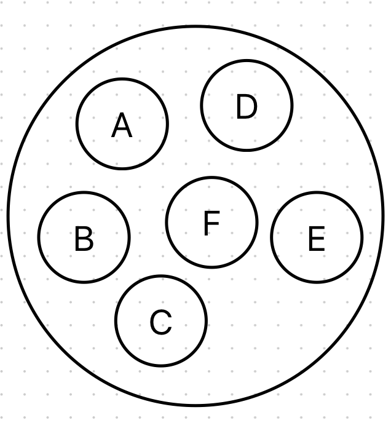

2. Dopo un'operazione di unione (es. union(a, b))

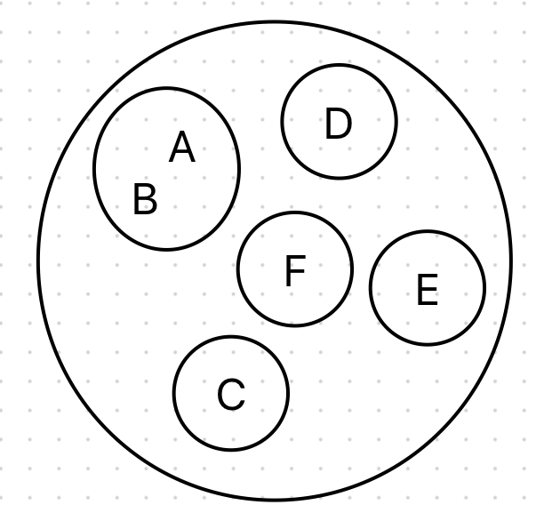

3. Dopo un certo numero di unioni potrei essere arrivato qui

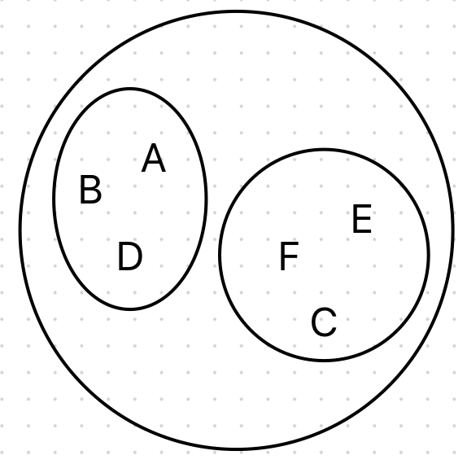

Esempio numerico:  
$S_1 = \{5, 12, 50\}$  
$S_2 = \{7\}$  
$S_3 = \{13, 2\}$  
Ognuno di essi può essere rappresentato da uno dei suoi elementi e vogliamo l'informazione sull'insieme stesso ma non ha una struttura interna quindi $S$ ha almeno un array con tutte queste chiavi

## Insiemi disgiunti: liste
Uso di liste collegate per gestire $S$ (`calS`)  
S $\in S$ è una lista con:
- `S.head` -> punta al primo elemento
- `S.tail` -> punta all'ultimo elemento

Ogni elemento x è dotato di:
- `x.next` -> punta all'elemento successivo
- `x.head` -> punta all'insieme S che lo contiene

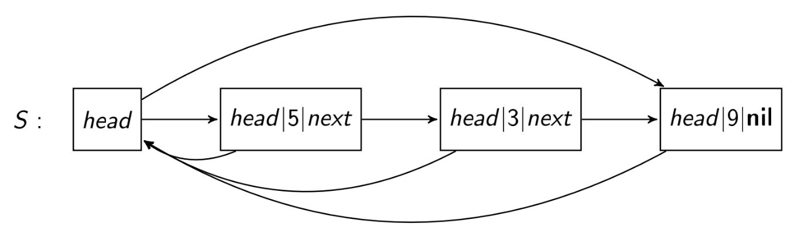

L'informazione aggiuntiva che contiene ogni `calS[i]` è un puntatore all'elemento `i` in memoria (casella x che contiene la chiave i) -> `calS[i].set`

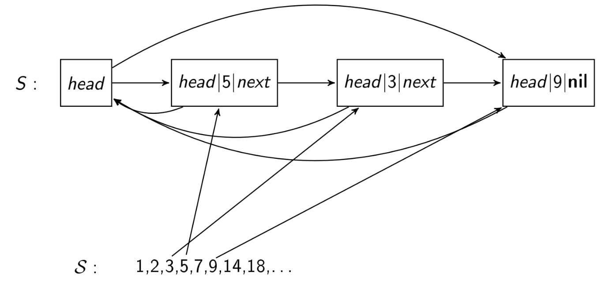

Esempio:

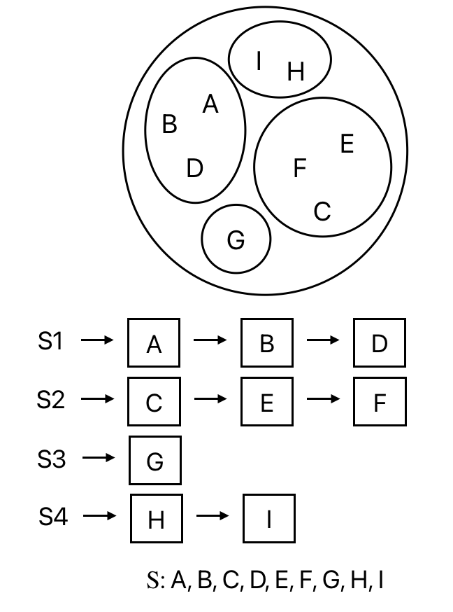

- MakeSet(x) -> crea nuovo oggetto S (`S.head = S.tail = x`) quindi costa $O(1)$
- Rappresentante di ogni S -> `S.head`
- FindSet(x) -> dato x, si cerca prima x.head poi x.head.head (restituisce il rappresentante dell'insieme di x) -> $O(1)$
- Union(x, y) -> unisce due insiemi in uno già esistente ed eliminando l'altro (es. Union(5, 7) -> $S_1 = \{5, 12, 50, 7\}, S_3 = \{13, 2\}$) -> $\Theta(n)$

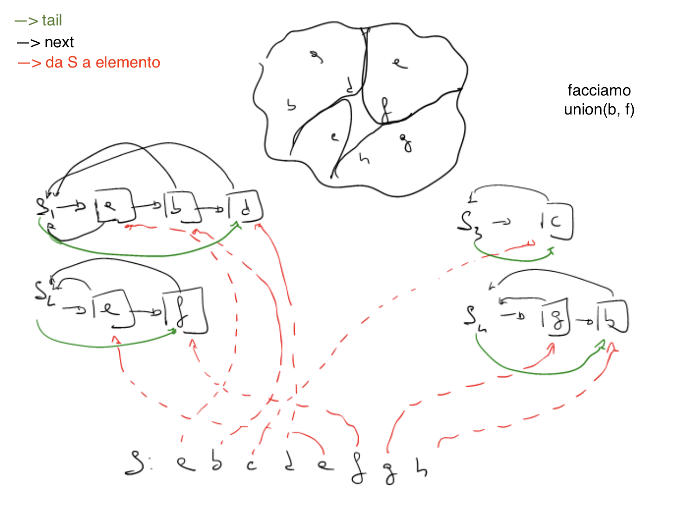

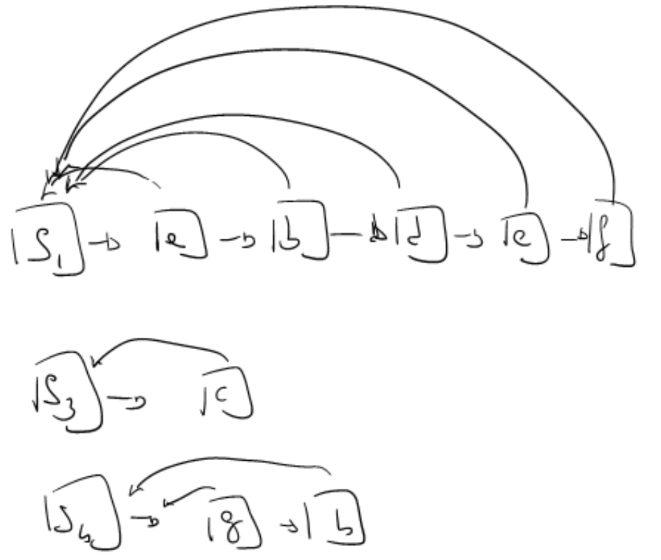

### Codici delle operazioni
```pseudocode
proc MakeSet (calS, S, x, i) {
    calS[i].set = x
    S.head = x
    S.tail = x
}
```

```pseudocode
proc FindSet (x) {
    return x.head.head
}
```

```pseudocode
proc Union (x, y) {
    S1 = x.head
    S2 = y.head
    if (S1 ≠ S2) {
        then
        S1.tail.next = S2.head
        z = S2.head
        while (z ≠ nil) {
            z.head = S1
            z = z.next
        }
        S1.tail = S2.tail
    }
}
```

### Complessità -> Analisi ammortizzata
**Analisi ammortizzata** -> calcolare il costo medio di un'operazione qualsiasi in un gruppo di operazioni piuttosto che il costo per operazione

Nell'implementazione con liste il caso peggiore si ha quando le operazioni iniziano con n MakeSet seguite da n-m Union nel peggior ordine possibile

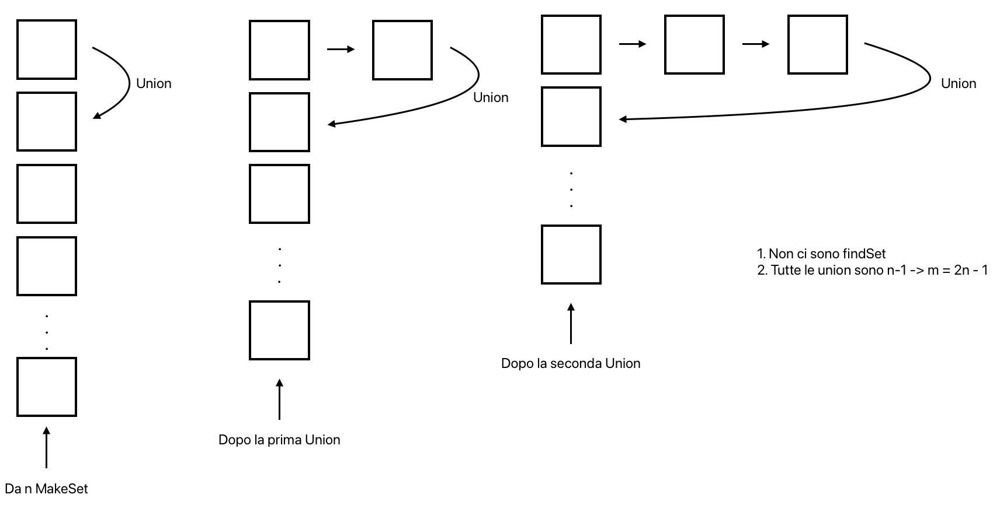

la prima union costa 1, la 2 costa 2, ..., fino all'ultima che costa n -> totale è $\Theta(n^2)$

Sapendo che m operazioni di cui n sono MakeSet() danno il caso peggiore nella situazione vista prima e che in quella situazione, $m = 2\cdot n-1 = \Theta(n)$, il costo medio ammortizzato di un'operazione è $\frac{\Theta(n^2)}{\Theta(n)} = \Theta(n)$

### Differenza tra analisi costo medio e costo ammortizzato
Nell'analisi di costo ammortizzato non ci sono considerazioni probabilistiche, calcola il costo medio di ogni operazione nei casi ottimo, medio, pessimo del gruppo di operazioni in questione.  
Si usa in questo caso poichè le operazioni su insiemi disgiunti sono tali che si influenzano a vicenda

## Insiemi disgiunti: liste con unione pesata (strategia o euristica)
**Euristica** -> strategia migliorativa e non un'implementazione diversa, ha un effetto soprattutto dal punto di vista pratico  
**Algoritmo Euristico** -> algoritmo che da una soluzione non ottimale si trova un problema la cui soluzione ottimale esiste, lo si fa per scelta per evitare il costo computazionale che avrebbe avuto quella esecuzione

Una strategia/euristica per migliorare l'implementazione con liste è usare l'unione pesata -> in ogni `S` si scrive anche il numero di elementi (`S.rank`) e con le `Union()` si fanno gli aggiornamenti dei puntatori sempre sull'insieme più piccolo

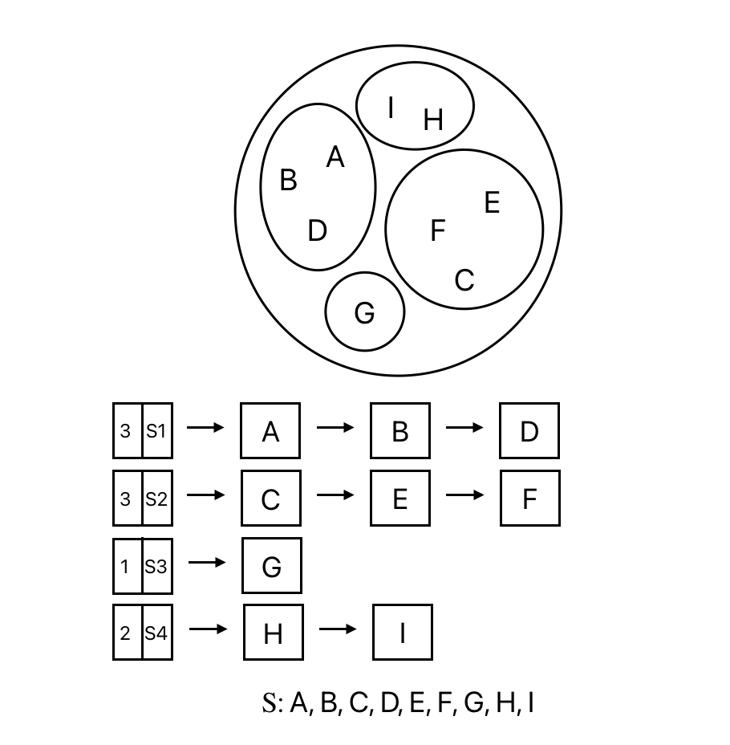

```pseudocode
proc MakeSet (calS, S, x, i) {
    calS[i].set = x
    S.head = x
    S.tail = x
    S.rank = 1
}
```

```pseudocode
proc Union (x, y) {
    S1 = x.head
    S2 = y.head
    if (S1 ≠ S2) {
        then
        if (S2.rank > S1.rank) {
            then SwapVariable(S1, S2)
        }
        S1.tail.next = S2.head
        z = S2.head
        while (z ≠ nil) {
            z.head = S1
            z = z.next
        }
        S1.tail = S2.tail
        S1.rank = S1.rank + S2.rank
    }
}
```

### Complessità
Nell'implementazione con lista e unione per rango si ha il caso peggiore quando tutti gli `S` sono di dimensione uguale (quando unisco liste della stessa lunghezza).

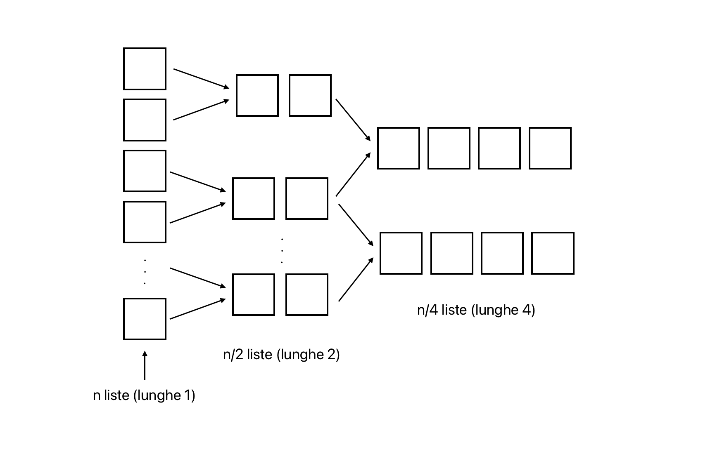

1. la prima costa n, la seconda n/2, la terza n/4, ..., l'ultima 1 -> per arrivare a una sola lista devo fare $\frac{n}{2} + \frac{n}{4} + \frac{n}{8} + ... + 1 = \sum_{i=1}^{\log(n)}{\frac{n}{2^i}} = \Theta(n)$ unioni
2. costo totale delle $\Theta(n)$ unioni è $\frac{n}{2} + 2 \cdot \frac{n}{4} + 4 \cdot \frac{n}{8} + ... = \log(n) \rightarrow \Theta(n \cdot log(n))$

Le n operazioni sono distribuite tra:  
n (MakeSet) + 0 (findSet) + $\Theta(n)$ (Union) e costante  
quindi:  
$\Theta(n)$ + $\Theta(1)$ + $\Theta(n \cdot log(n)) = \Theta(n \cdot log(n))$  
poichè $m = \Theta(n)$, il costo medio è:  
$\frac{\Theta(n \cdot log(n))}{\Theta(n)} = \Theta(log(n))$

## Insiemi disgiunti: foreste di alberi
Il metodo più efficiente per implementare insiemi disgiunti è usare le foreste di alberi.  
In questa rappresentazione gli elementi vivono come prima, nelle strutture S, e sono puntati in un albero, mentre i rank sono i limiti superiori dell'altezza dell'albero.

Rappresentazione:
- nodo x (elemento che non ha puntatore ai figli) contiene:
    - x.p -> padre
    - x.rank -> rango
- alberi (insiemi disgiunti) k-ari e formano una foresta `calS`

### Operazioni
#### MakeSet(x)
Crea un nuovo albero di altezza massima 0 (`rank = 0`) con il solo nodo x

#### FindSet(x)
Scorrendo i puntatori verso l'alto li aggiorna appiattendo il ramo al quale appartiene il rappresentante e lo restituisce

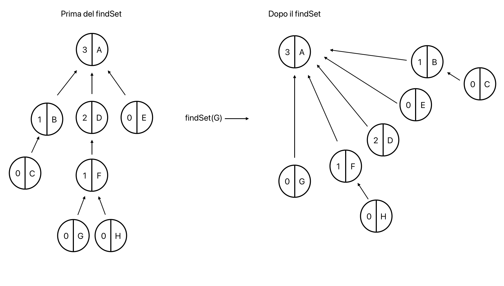

#### Union(x, y)
1. si trovano i rappresentanti degli elementi (x, y) usati come indici
2. si sceglie l'elemento di rango inferiore e si aggiorna solo il padre (si fa puntare il rappresentante con rango inferiore al rappresentante con rango superiore)

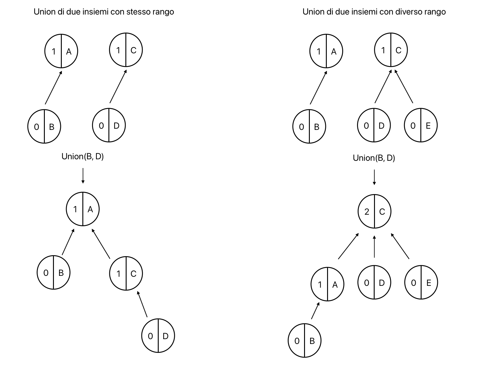

### Codici delle operazioni
```pseudocode
proc MakeSet (x) {
    x.p = x
    x.rank = 0
}
```

```pseudocode
proc FindSet (x) {
    if (x ≠ x.p) {
        then x.p = FindSet(x.p)
    }
    return x.p
}
```

```pseudocode
proc Union (x, y) {
    x = FindSet(x)
    y = FindSet(y)
    if (x.rank > y.rank) {
        then y.p = x
    } else {
        x.p = y
        if (x.rank = y.rank) {
            then y.rank = y.rank + 1
        }
    }
}
```

### Complessità
La complessità di $m$ operazioni si vede con $O(m \cdot \alpha(n))$ con $\alpha(n)$ funzione inversa di Ackermann che cresce lentamente (tanto da essere costante) quindi il costo è $O(m)$