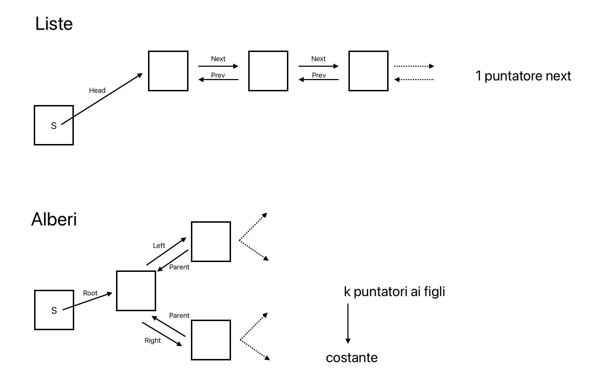
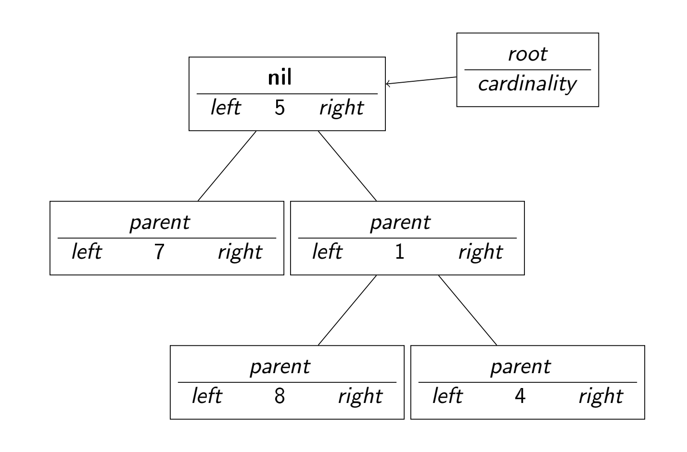
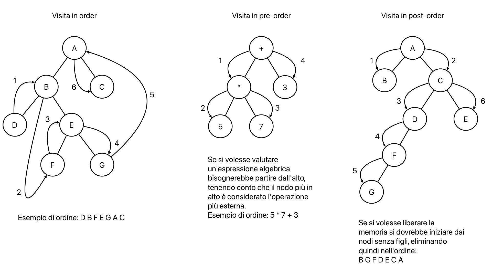

# Alberi
Gli alberi sono strutture dati dinamiche, sparse e, secondo l'uso che ne viene fatto, possono essere basate sull'ordinamento o meno.

Gli alberi generalizzano le liste ma se ne fa un uso diverso.



**Albero radicato**: grafo aciclico connesso in cui ogni coppia di vertici è connessa da un solo cammino.  
**Nodi**: vertici dell'albero.  
**Foglie**: nodi senza figli.  
**Albero k-ario**: ogni nodo ha al massimo k figli.  
**Altezza**: massimo numero di archi su un percorso semplice dalla radice ad una foglia (l'altezza è legata al numero di nodi in maniera non triviale).
- albero binario -> $\Theta(n \cdot log(n))$  
- nessuna struttura:
    - caso medio: $\Theta(log(n))$
    - caso peggiore: $\Theta(n)$


**Albero diretto**: ogni sottoalbero ha un nodo (radice) e un cammino prefissato dove si trovano in maniera naturale le foglie  
**Alberi indiretti**: la radice e la direzione del cammino vengono scelte in modo arbitrario

## Struttura
```pseudocode
struct nodo {
    int key;
    nodo *left;
    nodo *right;
    nodo *parent;
}

struct albero {
    nodo *root;
    + proprietà generali dell'albero (es. cardinalità);
}
```

Tutti i puntatori sono inizializzati a `nil`.  
L'operazione di creazione è immediata.  
Inserimento e cancellazione dipendono dalle operazioni che si vogliono fare.



Le strutture dati albero sono ideali per memorizzare oggetti di natura ricorsiva come formule matematiche o logiche.

> [!NOTE]
> Nelle liste e negli alberi si parla di visite poichè l'indirizzo di un elemento si scopre andandolo a visitare e non si sa a priori dove si trova.

Tipi di visite:
- in order
- pre order
- post order

### Operazioni per visite
```pseudocode
proc TreeInOrderTreeWalk (x) {
    if (x ≠ nil) {
        TreeInOrderTreeWalk(x.left)
        print(x.key)
        TreeInOrderTreeWalk(x.right)
    }
}

proc TreePreOrderTreeWalk (x) {
    if (x ≠ nil) {
        print(x.key)
        TreePreOrderTreeWalk(x.left)
        TreePreOrderTreeWalk(x.right)
    }
}

proc TreePostOrderTreeWalk (x) {
    if (x ≠ nil) {
        TreePostOrderTreeWalk(x.left)
        TreePostOrderTreeWalk(x.right)
        print(x.key)
    }
}
```



- **Terminazione**: termina sicuramente in quanto il numero di nodi è finito e prima o poi arriva ad un nodo `nil`
- **Correttezza**: tutti i nodi sono visitati almeno una volta
- **Complessità**:  
Non è direttamente collegata all'altezza quindi non c'è una separazione tra caso peggiore, medio e migliore.  
Si considera quindi il caso in cui si prende un nodo x per cui ci sono k nodi nel sotto albero radicato a sinistra --> allora ci sono n - k - 1 nodi nel sotto albero radicato a destra.  
Si calcola il costo di visitare gli elementi a sinistra (T(k)) e a destra (T(n - k - 1)) e il costo di visitare il nodo x (costante).  
$T(n) = T(k) + T(n - k - 1) + \Theta(1)$  
Per sostituzione si ottiene che $T(n) = \Theta(n)$

## Intuizione algoritmica
Vista l'alta versatilità degli alberi, si possono usare in molti modi diversi per sviluppare e testare l'intuizione algoritmica.  
Alcuni esempi possono essere:
- trovare un algoritmo per stampare tutte e sole le chiavi della frontiera di un albero binario qualsiasi
- trovare un algoritmo per stampare tutte e sole le chiavi del costato sinistro di un albero binario qualsiasi
- dire quale/i visite sono necessare per ricostruire la struttura dell'albero
- arricchire la struttura dell'albero in maniera che ogni nodo punti anche allo zio (se esiste) oltre che al padre