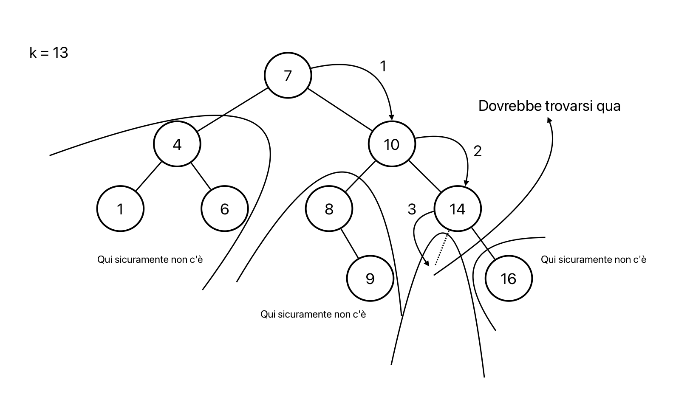

# Alberi Binari di Ricerca (BST)
Gli alberi binari di ricerca (Binary Search Trees, BST) sono una struttura dati dinamica, sparsa e basata sull'ordinamento.  
Poichè la struttura è basata sull'ordinamento delle chiavi possiamo effettuare le operazioni di: inserimento, cancellazione, ricerca, minimo, massimo, successore e predecessore.

## Regole per la definizione di un BST (proprietà BST)
Per definire un BST si devono seguire obbligatoriamente le seguenti regole per ogni nodo (proprietà BST):
- se un nodo y si trova nel sotto-albero sinistro --> y.key ≤ x.key
- se un nodo y si trova nel sotto-albero destro --> y.key > x.key

Quindi un BST è parzialmente ordinato


## Creazione e visita di un BST
I BST si creano vuoti come nel caso generale.

Sui BST ha senso effettuare la visita in order per restituire l'insieme di chiavi ordinate, ma non ha senso usare gli altri due tipi di visite.

## Operazioni sui BST

### Ricerca
```pseudocode
proc BSTTreeSearch (x, k) {
    if ( (x = nil) or (x.key = k) )
        return x
    if (k ≤ x.key)
        return BSTTreeSearch(x.left, k)
    else
        return BSTTreeSearch(x.right, k)
}
```



Complessità: è direttamente proporzionale all'altezza dell'albero
- caso peggiore: $\Theta(n)$
- caso medio: $\Theta(\log(n))$

### Minimo e Massimo
```pseudocode
proc BSTTreeMinimum (x) {
    if (x.left = nil)
        return x
    return BSTTreeMinimum(x.left)
}

proc BSTTreeMaximum (x) {
    if (x.right = nil)
        return x
    return BSTTreeMaximum(x.right)
}
```

Il nodo minimo è il nodo più a sinistra dell'albero.  
Il nodo massimo è il nodo più a destra dell'albero.

Complessità: è direttamente proporzionale all'altezza dell'albero
- caso peggiore: $\Theta(n)$
- caso medio: $\Theta(\log(n))$

### Successore e Predecessore
```pseudocode
proc BSTTreeSuccessor (x) {
    if (x.right ≠ nil)
        return BSTTreeMinimum(x.right)
    y = x.p
    while ( (y ≠ nil) and (x = y.right) ) {
        x = y
        y = y.p
    }
    return y
}

proc BSTTreePredecessor (x) {
    if (x.left ≠ nil)
        return BSTTreeMaximum(x.left)
    y = x.p
    while ( (y ≠ nil) and (x = y.left) ) {
        x = y
        y = y.p
    }
    return y
}
```


- Se x ha figlio destro --> il successore è il minimo del sotto-albero destro di x
- Se x non ha figlio destro --> il successore è tra i suoi antenati ovvero bisogna risalire finchè la relazione padre-figlio diventa padre-figlio sinistro

Complessità: è direttamente proporzionale all'altezza dell'albero
- caso peggiore: $\Theta(n)$
- caso medio: $\Theta(\log(n))$

### Inserimento
L'operazione di inserimento di un nodo inserisce un nuovo elemento come foglia nell'albero, questo permette di rispettare la proprietà BST ed essere efficiente.

`T` = BST  
`T.root = nil` -> albero vuoto, punta alla radice di `T` in caso contrario  
`z.left = z.right = z.p = nil` -> nodo `z` da inserire initilizzato a `nil`

```pseudocode
proc BSTTreeInsert (T, z) {
    y = nil
    x = T.root
    // scendo lungo l'albero finchè z.key ≤ x.key
    // quando x sarà nil avrò trovato la posizione corretta
    while (x ≠ nil) {
        y = x
        if (z.key ≤ x.key)
            x = x.left
        else
            x = x.right
    }
    // ora si decide se z sarà figlio sx, dx o root
    z.p = y
    if (y = nil)
        T.root = z
    if ( (y ≠ nil ) and (z.key ≤ y.key) )
        y.left = z
    if ( (y ≠ nil ) and (z.key > y.key) )
        y.right = z
}
```


**Correttezza**: si vuole dimostrare che il risultato di un inserimento sia un BST (T = BST, T' = risultato di un inserimento)
- se T è vuoto -> while non eseguito -> z è la radice di T' -> T' è un BST
- se T non è vuoto -> invariante del ciclo = posizione corretta di z è nel sotto-albero di x e y ne mantiene il padre:
    - caso base: x = T.root
    - caso induttivo: dopo la `i-1` esecuzione, z è confrontato con x e y, mantenendo la proprietà
    - alla fine del ciclo `x = nil` ed è nella posizione corretta di z

**Complessità**: è direttamente proporzionale all'altezza dell'albero
- caso peggiore: $\Theta(n)$
- caso medio: $\Theta(\log(n))$

### Eliminazione
L'operazione di eliminazione di un nodo può essere complessa, si distinguono 3 casi:
1. se z è foglia (non ha figli) -> si elimina z
2. se z ha un solo figlio -> si elimina z facendo puntare il padre di z al figlio di z (come eliminare un nodo in una lista)
3. se z ha due figli -> si cerca il successore di z (es. y) e si scambia z con y, poi si elimina y


```pseudocode
proc BSTTreeDelete (T, z) {
    // caso 1
    if (z.left = nil)
        BSTTreeTransplant(T, z, z.right)
    // caso 2.a o 2.b
    if ( (z.left ≠ nil) and (z.right = nil) )
        BSTTreeTransplant(T, z, z.left)
    // caso 3
    if ( (z.left ≠ nil) and (z.right ≠ nil) ) {
        y = BSTTreeMinimum(z.right)
        if (y.p ≠ z) {
            BSTTreeTransplant(T, y, y.right)
            y.right = z.right
            y.right.p = y
        }
        BSTTreeTransplant(T, z, y)
        y.left = z.left
        y.left.p = y
    }
}

proc BSTTreeTransplant (T, u, v) {
    if (u.p = nil)
        T.root = v
    if ( (u.p ≠ nil) and (u = u.p.left) )
        u.p.left = v
    if ( (u.p ≠ nil) and (u = u.p.right) )
        u.p.right = v
    if (v ≠ nil)
        v.p = u.p
}
```

**Complessità**:
- caso peggiore: $\Theta(n)$
- caso medio: $\Theta(\log(n))$