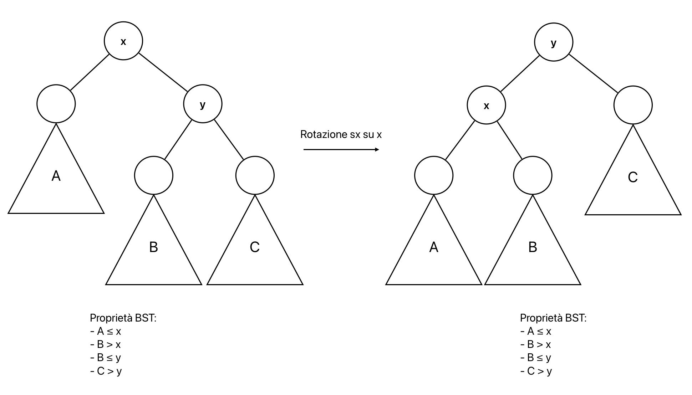

# Alberi Red - Black (RBT)
Un albero Red-Black (RBT) è un BST bilanciato per costruzione.  
Ha tutte le caratteristiche di un BST, ma ha l'altezza di $\Theta(log(n))$ (con n = numero di nodi).  
Un RBT è una struttura dati dinamica, sparsa e basata sull'ordinamento.

Ogni nodo di un RBT ha delle informazioni in più rispetto ai BST:
- il colore (x.color) -> rosso o nero
- ogni foglia (nodo senza figli) possiede due figli "virtuali" che non hanno chiavi e sono sempre neri
- definita una sentinella `T.Nil` -> campo aggiuntivo di T

La root è un nodo "virtuale" nero, senza chiave e senza figli.  

I nodi esterni e interni si differenziano per proprietà:
- foglia esterna -> nodo nero senza chiave con proprietà uguali agli altri nodi
- nodo interno -> ha sempre due figli e una chiave

Esempio di RBT con 7 nodi interni e 8 nodi esterni:


## Regole per la definizione di un RBT (proprietà RBT)
1. Ogni nodo è rosso o nero
2. La root è nera
3. Ogni foglia (esterna, `T.Nil`) è nera
4. Se un nodo è rosso, allora entrambi i suoi figli sono neri
5. Per ogni nodo, tutti i cammini semplici da quel nodo alle foglie contengono lo stesso numero di nodi neri

## Garanzie delle proprietà di un RBT
Le proprietà garantiscono il bilanciamento dell'albero.  
Il bilanciamento è una proprietà dinamica -> relazione tra numero di nodi e altezza.

Altezza nera (`bh(x)`) di un nodo x in T: numero di nodi neri su qualsiasi per corso semplice da x (senza contare x) ad una foglia esterna (contandola).  
Altezza nera dell'albero T: altezza nera della root `bh(T.root)`.

Il sotto-albero in x ha almeno $2^{bh(x)} - 1$ nodi interni per la proprietà 5.

Per la proprietà 4, almeno la metà dei nodi dalla radice (esclusa) ad una foglia su qualsiasi ramo è nera quindi bh(T.root) ≥ $\frac{h}{2}$ (con h altezza di T)  
numero n di nodi in T: $n ≥ 2^{bh(T.root)}-1 \longrightarrow n ≥ 2^{\frac{h}{2}}-1$

$h ≤ 2 \cdot \log(n+1)$ --> l'altezza nel caso peggiore è di 2 volte il logaritmo del numero di nodi interni più 1 quindi è $\Theta(log(n))$.

Quindi l'altezza di un RBT è $\Theta(log(n))$ ovvero è bilanciato.

## Mantenimento delle proprietà di un RBT
Le operazioni di inserimento e cancellazione potrebbero violare le proprietà di un RBT quindi implementando queste operazioni si modifica la struttura dell'albero per ripristinare le proprietà.

Per ripristinare la struttura si usa la **rotazione**: operazione per mantenere le proprietà di un BST (non di un RBT).

### Rotazioni
Modificando i puntatori tra i nodi si può mantenere la struttura di un BST.



```pseudocode
proc BSTTreeLeftRotate (T, x) {
    y = x.right
    x.right = y.left
    if (y.left ≠ T.Nil)
        y.left.p = x
    y.p = x.p
    if (x.p = T.Nil)
        T.root = y
    if ( (x.p ≠ T.Nil) and (x = x.p.left) )
        x.p.left = y
    if ( (x.p ≠ T.Nil) and (x = x.p.right) )
        x.p.right = y
    y.left = x
    x.p = y
}
```


**Complessità**: O(1)

## Inserimento in un RBT
Usando l'algoritmo di inserimento dei BST, BSTTreeInsert, le proprietà dei BST sono rispettate.  
Se il nodo inserito è rosso si avrà:
- proprietà 1 -> rispettata
- proprietà 2 -> violata (z diventa la root che dovrebbe essere nera)
- proprietà 3 -> rispettata
- proprietà 4 -> violata (z diventa figlio di un nodo rosso che dovrebbe essere nero)
- proprietà 5 -> rispettata

Per mantenere le proprietà si usa la procedura RBTreeInsertFixup.

```pseudocode
proc RBTreeInsert (T, z) {
    y = T.Nil
    x = T.root
    while (x ≠ T.Nil) {
        y = x
        if (z.key < x.key)
            x = x.left
        else
            x = x.right
    }
    z.p = y
    if (y = T.Nil)
        T.root = z
    if ( (y ≠ T.Nil) and (z.key < y.key) )
        y.left = z
    if ( (y ≠ T.Nil) and (z.key ≥ y.key) )
        y.right = z
    z.left = T.Nil
    z.right = T.Nil
    z.color = RED
    RBTreeInsertFixup(T, z)
}
```
Esempio di inserimento di un nodo rosso da fixare:


```pseudocode
proc RBTreeInsertFixup (T, z) {
    while (z.p.color = RED) {
        if (z.p = z.p.p.left)
            RBTreeInsertFixUpLeft(T, z)
        else
            RBTreeInsertFixUpRight(T, z)
    }
    T.root.color = BLACK
}
```

La riga `if (z.p = z.p.p.left)` genera due casi che dipendono se `z.p` è figlio dx o sx di `z.p.p`.  
Dentro `RBTreeInsertFixUpLeft(T, z)` o `RBTreeInsertFixUpRight(T, z)` ci sono 3 sotto-casi distinti a seconda del colore di `y` (zio di `z`):
1. se `y` è rosso -> caso 1
2. se `y` è nero e `z` è figlio sx -> caso 2
3. se `y` è nero e `z` è figlio dx -> caso 3

```pseudocode
proc RBTreeInsertFixUpLeft (T, z) {
    y = z.p.p.right
    // caso 1
    if (y.color = RED) {
        z.p.color = BLACK
        y.color = BLACK
        z.p.p.color = RED
        z = z.p.p
    } else {
        // caso 3
        if (z = z.p.right) {
            z = z.p
            BSTTreeLeftRotate(T, z)
        }
        // caso 2
        z.p.color = BLACK
        z.p.p.color = RED
        BSTTreeRightRotate(T, z.p.p)
    }
}

proc RBTreeInsertFixUpRight (T, z) {
    y = z.p.p.left
    // caso 1
    if (y.color = RED) {
        z.p.color = BLACK
        y.color = BLACK
        z.p.p.color = RED
        z = z.p.p
    } else {
        // caso 2
        if (z = z.p.left) {
            z = z.p
            BSTTreeRightRotate(T, z)
        }
        // caso 3
        z.p.color = BLACK
        z.p.p.color = RED
        BSTTreeLeftRotate(T, z.p.p)
    }
}
```


**Osservazioni:**
1. se da un albero normale `z.p` diventa nullo ovvero `z.p = T.Nil` (`z` diventa root) -> `while (z.p.color = RED)` evita errori a runtime e subito all'uscita del ciclo esegue `T.root.color = BLACK`
2. se `z` è figlio diretto della radice -> `z.p` è la root quindi `z.p.p = T.Nil` e `z.p.p.left = T.Nil ≠ z.p` e `z.p.p.right = T.Nil ≠ z.p` quindi tutti gli if sono ben definiti


**Correttezza**: se esiste il problema dopo l'inserimento (proprietà 2 e 4 violata) si spinge verso l'alto con il caso 1 finchè possibile. Quando non è più possibile si passa al caso 2 o 3. Una rotazione risolve il problema e esce dal ciclo.  
**Invariante**:
1. z è rosso
2. se z.p è la root -> z.p è nero
3. se T vìola qualche prioprietà -> vìola una sola proprietà:
    - se vìola la proprietà 4 -> z e z.p sono rossi
    - se vìola la proprietà 2 -> z è la root rossa

Dopo il caso 2 o 3 si ha tutte le proprietà rispettate.

**Complessità**: nel caso peggiore costa tanto quanto risalire l'albero fino alla root quindi $\Theta(h) = \Theta(log(n))$.