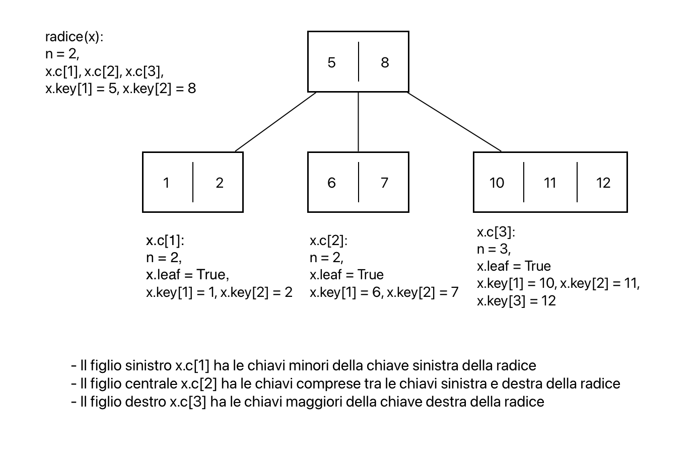

# Alberi B (BT = Balanced Tree)
Gli alberi B sono una struttura dati dinamica, sparsa e basata sull'ordinamento.  
Un albero B generalizza un albero RB, quindi mantiene la proprietà di bilanciamento ma ha fini diversi.  
Un albero B è sempre completo -> il nodo stesso deve contenere più chiavi.  
Gli alberi B sono ottimizzati per minimizzare gli accessi al disco (memoria secondaria).

## Struttura
Un albero B si caratterizza per:
1. possedere un'arietà (branching factor) superiore ad un parametro, il grado minimo = t, che in questo caso è 2 (spesso dell'ordine delle migliaia)
2. un'altezza proporzionale al logaritmo in base n (con n numero di chiavi)
3. avere nodi con molte chiavi ordinate tra loro
4. crescere verso l'alto, non verso il basso (un nodo inzia da radice poi diventa un nodo interno e il nuovo nodo è radice, ...)

La complessità delle operazioni è proporzionale all'altezza.

### Struttura nodo
Un nodo di un albero B è composto da:
- x.p -> puntatore al padre
- x.n -> numero di chiavi nel nodo
- x.leaf -> booleano che indica se il nodo è foglia
- x.c[1...x.n+1] -> puntatori ai figli se x.leaf = true, altrimenti nil
- x.key[1...x.n] -> n chiavi ordinate

Proprietà:
- ogni nodo, tranne la radice, ha almeno t-1 chiavi
- ogni nodo ha al massimo 2*t-1 chiavi
- per ogni nodo x, `x.key[i]` ≤ `x.key[i+1]`
- per ogni nodo x, se un nodo y è nel sotto-albero di `x.c[i]` -> tutte le sue chiavi sono maggiori di `x.key[i-1]` e minori o uguali di `x.key[i]` (se `x.key[i]` esiste)
- tutte le foglie hanno la stessa altezza



Definendo un grado minimo = t ≥ 2 di un BT si ottiene per le proprietà:
- ogni nodo, tranne la radice, ha almeno t-1 chiavi -> ogni nodo interno, tranne la radice, ha lameno t figli
- ogni nodo ha al massimo 2*t-1 chiavi -> ogni nodo interno ha al massimo 2t figli (nodo pieno)

Altezza massima: $h ≤ \log_t(\frac{n+1}{2}) = O(\log_t(n))$

## Operazioni di Ricerca, Inserimento, Creazione chiave
Convenzioni:
- DiskRead e DiskWrite come operazioni di accessi al disco
- calcolo della complessità per:
    - uso di CPU
    - numero di accessi al disco
- la radice T.root è sempre in memoria principale
- se un nodo è passato come parametro, è già stata eseguita la DiskRead

### Ricerca
Generalizzazione della ricerca su BST:
- si sceglie tra x.n + 1 possibili figli
- prende in input un nodo x di T e una chiave k
- restituisce 
    - un puntatore ad un nodo y
    - un indice i se ricerca ha successo altrimenti nil

```pseudocode
proc BTreeSearch(x, k) {
    i = 1
    while ( (i ≤ x.n) and (k > x.key[i]) )
        i = i + 1
    if ( (i ≤ x.n) and (k == x.key[i]) )
        return (x, i)
    if (x.leaf = true)
        return nil
    DiskRead(x.c[i])
    return BTreeSearch(x.c[i], k)
}
```


**Complessità**:
- numero di accessi al disco: $O(h) = O(\log_t(n))$
- uso di CPU: $\Theta(t \cdot h) = \Theta(t \cdot \log_t(n))$
- con i BT il $\log_t()$ cresce molto più lentamente rispetto al $\log_2()$ così da portare il numero di accessi al disco a valori molto bassi

### Creazione
Per fare un inserimento prima l'albero deve esistere (vuoto)

```pseudocode
proc BTreeCreate(T) {
    x = Allocate()
    x.leaf = true
    x.n = 0
    DiskWrite(x)
    T.root = x
}
```

Allocate() -> funzione che crea e occupa uno spazio sufficiente per un nodo in memoria secondaria  
Questa fase fa capire che un BT cresce a partire dalle foglie (verso l'alto)

### Split del figlio per l'inserimento
Funzionamento:
1. riempire un nodo fino a quando diventa pieno (2t-1 chiavi)
2. dividere il nodo in due nodi di t-1 chiavi l'uno
3. inserire la nuova chiave nel nodo padre
4. se il nodo padre è pieno, ripetere l'operazione un livello più in alto

T cresce solo quando la divisione avviene sulla radice -> si crea nuovo nodo radice e si usa la divisione

Assunzioni:
- x = nodo interno, non pieno, già nella memoria principale
- x.c[i] = figlio di x, pieno, già nella memoria principale -> diviso in due nodi
- i = punto di split

```pseudocode
proc BTreeSplitChild(x, i) {
    z = Allocate()
    y = x.c[i]
    z.leaf = y.leaf
    for (j = 1 to t - 1)
        z.key[j] = y.key[j + t]
    if (y.leaf = false)
        for (j = 1 to t)
            z.c[j] = y.c[j + t]
    y.n = t - 1
    for (j = x.n + 1 downto i + 1)
        x.c[j + 1] = x.c[j]
    x.c[i + 1] = z
    for (j = x.n downto i)
        x.key[j + 1] = x.key[j]
    x.key[i] = y.key[t]
    x.n = x.n + 1
    DiskWrite(y)
    DiskWrite(z)
    DiskWrite(x)
}
```


**Complessità**:
- numero di accessi al disco: $\Theta(1)$
- uso di CPU: $\Theta(t)$

### Inserimento di una chiave
L'operazione di inserimento usa una seconda operazione, BTreeInsertNonFull, che inserisce ricorsivamente una chiave in un nodo non pieno.  
La chiave nuova va sempre inserita in una foglia quindi:
- se il nodo considerato è una foglia -> si inserisce la chiave
- se il nodo considerato non è una foglia -> si scende ricorsivamente in un nodo e ...
    - ... se è pieno si divide e si procede ricorsivamente (pre-emptive split)

**Importante:**  
Il pre-emptive split permette di effettuare split su ogni nodo pieno che si trova sul percorso di discesa fino alla foglia in cui si deve andare.  
Il motivo per cui si fanno anche divisioni non necessarie su ogni nodo pieno che si trova sul percorso è che si evita di dover fare divisioni su nodi pieni in futuro.  
In questo modo si minimizza il numero di accessi al disco e l'uso di CPU.

**Inserimento di una chiave k in un nodo x:**
```pseudocode
proc BTreeInsert(T, k) {
    r = T.root
    // se il nodo è pieno
    if (r.n == 2t - 1) {
        s = Allocate()
        T.root = s
        s.leaf = false
        s.n = 0
        s.c[1] = r
        BTreeSplitChild(s, 1)
        BTreeInsertNonFull(s, k)
    }
    else
        BTreeInsertNonFull(r, k)
}
```

**Inserimento in un nodo non pieno:**
```pseudocode
proc BTreeInsertNonFull(x, k) {
    i = x.n
    if (x.leaf = true) {
        // si spostano a dx gli elementi necessari
        // e si inserisce la chiave
        while ( (i ≥ 1) and (k < x.key[i]) ) {
            x.key[i + 1] = x.key[i]
            i = i - 1
        }
        x.key[i + 1] = k
        x.n = x.n + 1
        DiskWrite(x)
    }
    else {
        // trova il sotto-albero in cui inserire la chiave
        while ( (i ≥ 1) and (k < x.key[i]) )
            i = i - 1
        i = i + 1
        DiskRead(x.c[i])
        // se il figlio è pieno -> split
        if (x.c[i].n == 2t - 1) {
            BTreeSplitChild(x, i)
            if (k > x.key[i])
                i = i + 1
        }
        BTreeInsertNonFull(x.c[i], k)
    }
}
```

**Correttezza**: 
- **caso base:** all'inizio di ogni esecuzione di BTreeInsertNonFull, il nodo x è non pieno e la chiave k viene inserita nel sotto-albero di x, in uno dei suoi figli.
- **caso induttivo:** si trova il posto giusto per k e, poichè x non è foglia, carica il giusto figlio. Essendo il nodo non pieno per ipotesi (se nodo pieno -> split) si richiama BTreeInsertNonFull

**Complessità**:
- numero di accessi al disco: $\Theta(h) = \Theta(\log_t(n))$
- uso di CPU: $\Theta(t \cdot h) = \Theta(t \cdot \log_t(n))$